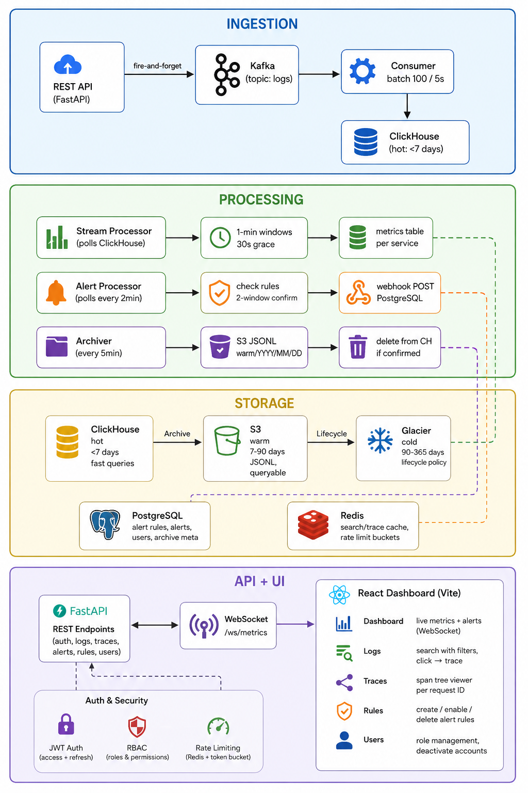

# Distributed Log Analytics Platform

A self-hosted observability system built to explore high-throughput log ingestion, stream processing, distributed tracing, tiered storage, and real-time analytics — the kind of problems that sit at the core of systems like the ELK stack.

Built entirely from scratch, solo, and deployed on AWS EC2.

**Live demo:** `http://18.191.36.209` — login with `admin` / `admin123`
*(hosted on AWS EC2 free tier — may be stopped to avoid costs; run locally with docker-compose in under 2 minutes)*

---

## What it does

- Ingests logs via a fire-and-forget Kafka pipeline and stores them across a hot-warm-cold tier (ClickHouse → S3 → Glacier)
- Aggregates per-service metrics in real-time using 1-minute tumbling windows with late-event handling
- Reconstructs distributed request traces from correlated logs across services
- Fires alerts via webhooks when metrics breach configurable thresholds, with noise-reduction logic to prevent false positives
- Serves a live React dashboard over WebSockets with search, trace viewer, and alert management

---

## Architecture



---

## Performance

Measured on a local machine using `benchmark.py` against a running docker-compose stack:

- Sustained ingestion above **5,200 logs/sec** via Kafka batching
- Hot-tier search latency: **~51ms** uncached (ClickHouse columnar scan), **~34ms** cached (Redis)
- Trace lookup: **~18ms** average

See [DETAILS.md](DETAILS.md) for full benchmark methodology and numbers.

---

## Tech Stack

| Layer | Technology | Why |
|-------|-----------|-----|
| API | FastAPI (Python) | Async, automatic OpenAPI docs |
| Message queue | Apache Kafka | Decouples ingestion from storage, absorbs traffic spikes |
| Hot storage | ClickHouse | Columnar DB optimized for analytical log queries |
| Warm storage | AWS S3 (JSONL) | Cheap, durable, queryable without restore |
| Cold storage | AWS Glacier | Lifecycle policy from S3, near-zero cost |
| Relational DB | PostgreSQL | Transactional data: users, alert rules, archive metadata |
| Cache | Redis | Query cache + token bucket rate limiting |
| Frontend | React + Vite | Component-based UI, fast dev server |
| Real-time | WebSocket (native) | Server pushes metrics every 5s, no polling |
| Auth | JWT + bcrypt | Stateless access tokens, bcrypt password hashing |
| Infra | Docker Compose + Terraform | Local setup + AWS provisioning |

---

## Running Locally

**Prerequisites:** Docker, Docker Compose, Node.js 18+

```bash
# 1. Clone and set up environment
git clone <repo-url>
cd Distributed_Log_Analytics
cp .env.example .env  # edit with your AWS credentials if using S3

# 2. Start all backend services
docker-compose up -d

# 3. Verify everything is running
curl http://localhost:8000/health
# → {"status": "healthy"}

# 4. Start the React dashboard
cd dashboard
npm install
npm run dev
# → http://localhost:5173
```

**Default credentials:** `admin` / `admin123`

---

## API

Full OpenAPI docs available at `http://localhost:8000/docs` when running locally.

Core endpoints:

- `POST /logs/ingest` — batch ingest logs
- `GET /logs/search` — search by service, level, time window, tier
- `GET /traces/{request_id}` — full span tree for a request
- `POST /alert_rules` / `GET /alert_rules` — manage alert rules
- `GET /alerts` — list firing and resolved alerts
- `ws://host/ws/metrics` — live metrics over WebSocket

---

## Project Structure

```
src/
├── api/          # FastAPI routers + dependency chain (auth, rate limit)
├── core/         # JWT, exceptions, middleware, rate limiter
├── db/           # ClickHouse + PostgreSQL clients
├── services/     # Cache, S3, webhook, auth logic
├── workers/      # Consumer, stream processor, alert processor, archiver
└── models/       # Pydantic request/response models

dashboard/        # React + Vite frontend
docker-compose.yml
terraform/        # AWS EC2, S3, IAM provisioning
```

---

## Design Decisions

See [DESIGN_DECISIONS.md](DESIGN_DECISIONS.md) for the reasoning behind every major choice — why ClickHouse over PostgreSQL for logs, how the alert state machine works, why the rate limiter fails open, and what would change at production scale.

---

## Future Improvements

- Cold tier query with Glacier restore (initiate restore → poll → download)
- WebSocket authentication (token as query param on connect)
- Log search within trace view (filter by request_id without leaving trace viewer)
- Multi-tenant support (isolate data per organization)
- Kafka partition scaling (currently single partition)
